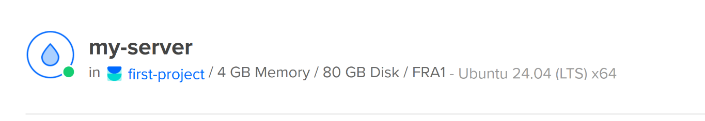
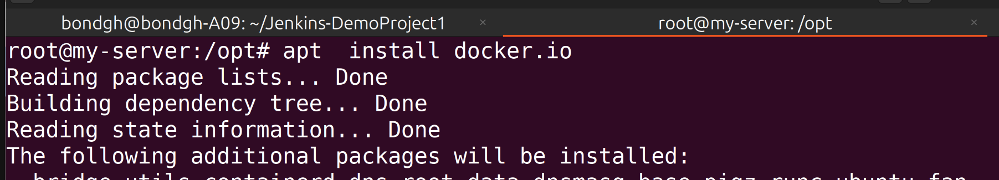
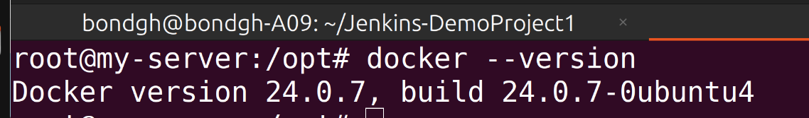
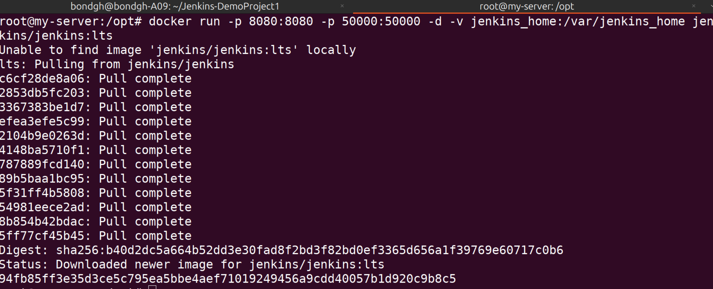
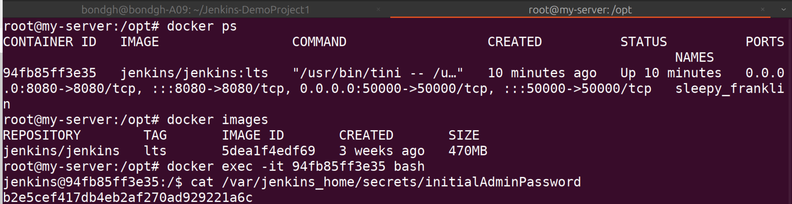
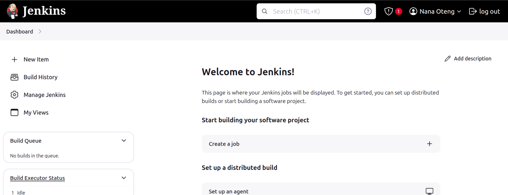

<h1>Jenkins-DemoProject1</h1>

<h2>Project Description</h2>
 1. Create an Ubuntu server on DigitalOcean 
 2. Set up and run jenkins as Docker container 
 3. initialize jenkins 
 

<h2>Technologies used</h2> 
- <b>Jenkins</b>  
- <b>Docker</b>  
- <b>DigitalOcean</b>  
- <b>Linux</b>  

<h2>Detailed Description of Project </h2>

  Create droplet ("my-server") 
  Create and configure firewall on DigitalOcean("server-firewall"):  
  set inbound rules 
  set my client PC ip as ssh source so that only my PC can ssh into the server 
  Login to DigitalOcean 
  Select droplet 
  create droplet 
  chose the closest region where you want droplet to be created 
  Select Ubuntu Operating system 
  Select the version (eg. 24.04 (lts)*64) 
  Select CPU options 
  Create droplet 
   My-server has been created
  

  2. install docker on the server  
     Set up and run jenkins as Docker container 
     ssh into the server (ssh root@publicIP) 
     update the binaries (apt update) 
     install docker (apt install docker.io)
  
  

  3. install Jenkins as docker image 
   docker ps 
   login to the jenkins running container (docker exec -it containerId bash) 
   configure firewall custom port and add jenkins container port 8080 
   enter the publicIp of the jenkins server and the port where jenkins is running into the browser 
   (publicIp:port) 
   get the content of the password for jenkins 
   install plugins 
  

  
    Jenkins image has been pulled from dockerhub and the container is running as well
   

  
  4. initialize Jenkins  
   
  
     
  
  
  
  

       

    

  

 

  

